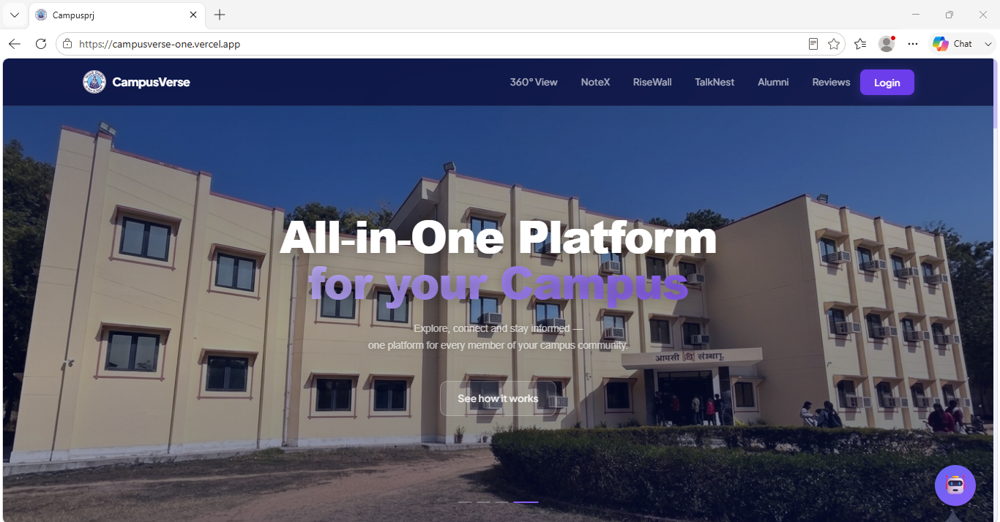
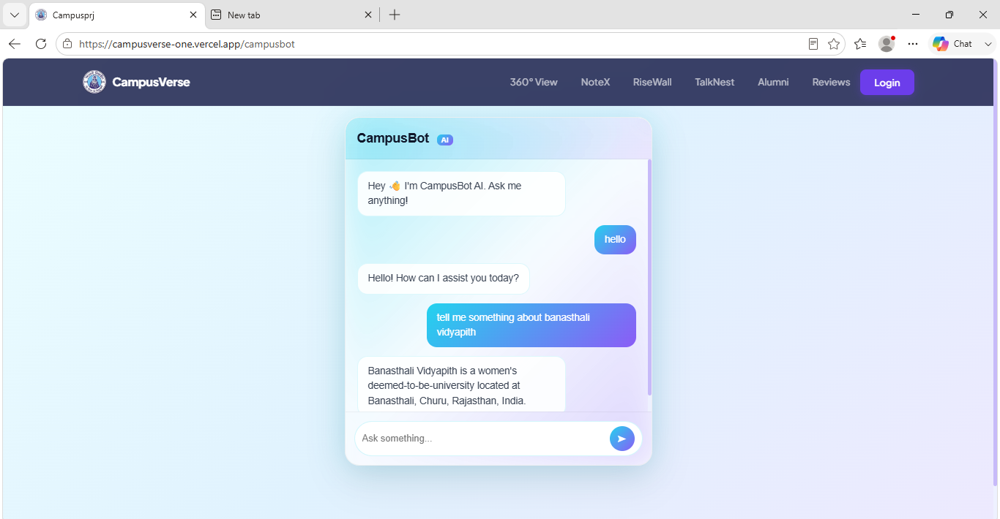
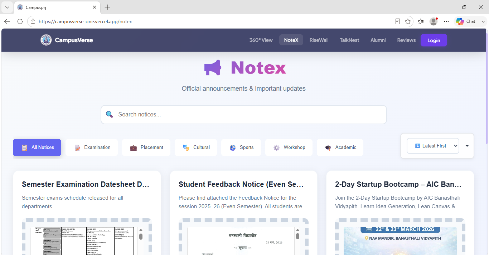
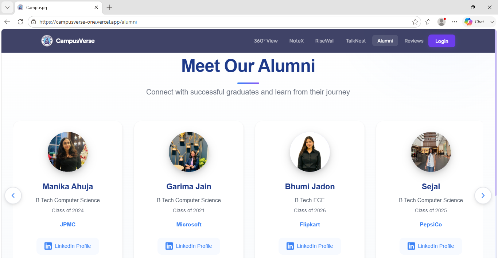

# 🎓 CampusVerse

## 🌐 AI-Powered Smart Campus Platform

**Live Demo:** https://campusverse-one.vercel.app/

## 📖 Overview

CampusVerse is a full-stack smart campus platform that brings together
essential campus services into one modern web application. It includes
an AI chatbot, digital notice board, alumni directory, student community
features, and a virtual campus experience.

## ✨ Key Features

### 🤖 CampusBot AI

-   AI-powered campus assistant
-   Instant responses for students and visitors

### 📢 NoteX

-   Digital notice board
-   Searchable and categorized announcements

### 👥 Alumni Connect

-   Alumni profiles
-   Company information
-   LinkedIn integration

### 🌐 360° Campus Tour

-   Interactive virtual campus experience

### 💬 TalkNest

-   Student community interaction

### 🏆 RiseWall

-   Student achievements showcase

## 📸 Screenshots

Create an `assets/` folder and add:

-   home.png
-   campusbot.png
-   notex.png
-   alumni.png









## 🛠 Tech Stack

  Layer        Technology
  ------------ -------------------
  Frontend     React + Vite
  Backend      Node.js + Express
  Database     MongoDB
  AI           CampusBot
  Deployment   Vercel + Render

## 🏗 Architecture

``` text
Users
  │
React Frontend
  │
Node.js + Express
  │
MongoDB + AI Chatbot
```

## 🚀 Installation

``` bash
git clone https://github.com/anikagupta28/Campusverse.git
cd Campusverse
```

Frontend

``` bash
cd frontend
npm install
npm run dev
```

Backend

``` bash
cd backend
npm install
npm start
```

## 🔮 Future Enhancements

-   Student authentication
-   Event registration
-   Hostel management
-   Push notifications
-   Mobile application

## 👩‍💻 Author

**Anika Gupta**

GitHub: https://github.com/anikagupta28

Live Demo: https://campusverse-one.vercel.app/

------------------------------------------------------------------------

⭐ If you like this project, please give it a star.
